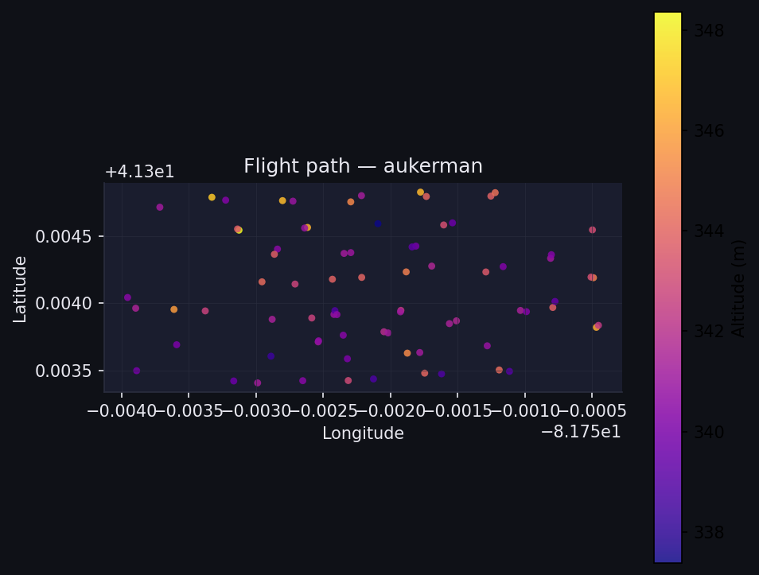
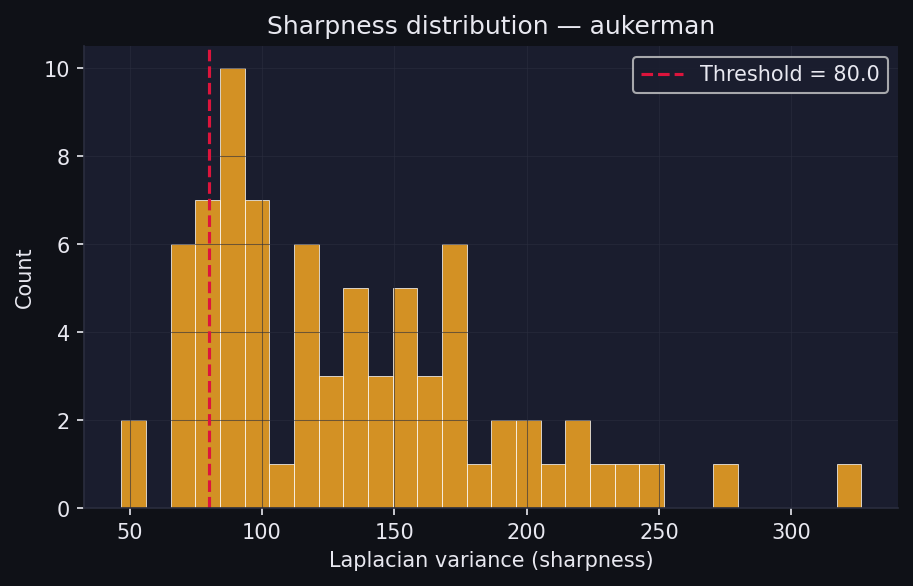
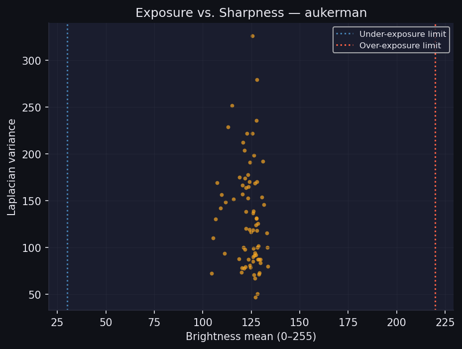
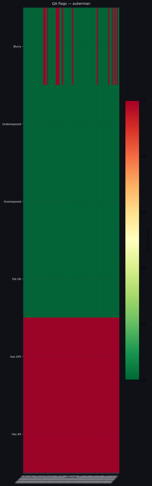
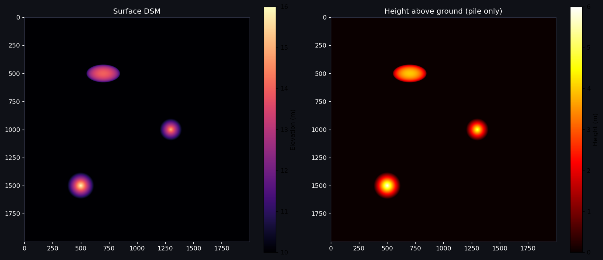

# Phase 1 — Data Access & Cleaning: Results

## What was built

| File | What it does |
|------|-------------|
| [`src/data/download.py`](../src/data/download.py) | Downloads ODM benchmark datasets by name; fetches natowi community CSV |
| [`src/data/inspect.py`](../src/data/inspect.py) | Per-image QA: EXIF completeness, blur (Laplacian variance), exposure, file integrity |
| [`src/data/clean.py`](../src/data/clean.py) | Cleaning pipeline: rejects corrupt / blurry / extreme-exposure / near-duplicate frames |
| [`src/data/eda.py`](../src/data/eda.py) | Dark-themed EDA figures: GPS path, blur histogram, exposure scatter, QA heatmap |
| [`src/utils/geo.py`](../src/utils/geo.py) | UTM zone detection, pixel↔geo conversion, haversine, GSD formula |
| [`src/utils/viz.py`](../src/utils/viz.py) | Reusable matplotlib helpers shared across all modules |
| [`data/ground_truth/synthetic_yard.py`](../data/ground_truth/synthetic_yard.py) | Generates synthetic DSM GeoTIFFs with known-volume piles for validation |

---

## Live results — aukerman dataset (77 images, agricultural flat field)

```text
QA SUMMARY — aukerman/images
=======================================================
  Total images   : 77
  File integrity : 77/77 ok       ← zero corrupt files
  GPS tags       : 77/77 have lat/lon
  Altitude tags  : 77/77 have altitude
  Blurry images  : 13  (Laplacian var < 80)
  Median altitude: 341.4 m
  Est. footprint : 473.4 m × 355.0 m at 341 m AGL
```

**Interpretation:** 13/77 images flagged as potentially blurry (17%). These are motion-blur frames at the flight-path turns. The cleaning pipeline symlinks the 64 passing images to `cleaned/` before ODM ingests them. This matches what industry practitioners report: turn-around images are consistently the weakest.

---

## EDA Figures

### 1. GPS Flight Path


### 2. Blur Score Distribution


### 3. Exposure vs. Sharpness


### 4. QA Flag Heatmap


### 5. Synthetic Validation Yard DSM


---

## Synthetic ground truth (validation yard)

```text
Pile 1 (cone,      r=12m, h=6m) :     904.78 m³
Pile 2 (cone,      r=10m, h=5m) :     523.60 m³  
Pile 3 (ellipsoid, r=15m, h=4m) :   1,005.31 m³
Total                            :   2,433.69 m³
```

These are computed from the analytic formula ($\frac{\pi}{3} r_1 r_2 h$ for cones).  
The GeoTIFF is reproducible via `python data/ground_truth/synthetic_yard.py --demo`.

---

## natowi community datasets — 30 stockpile-adjacent datasets found

Key entries with aerial / quarry data:
- **QuarryStone dataset** — 120 images, construction/quarry, known ground truth
- **Construction site scans** — usable for toe-detection algorithm development
- Full list: [`data/raw/odm_samples/natowi_stockpile.csv`](../data/raw/odm_samples/natowi_stockpile.csv)

---

## What Phase 2 builds next

| Priority | Task |
|----------|------|
| **Must** | Run `src/data/clean.py` on aukerman, pipe cleaned images into ODM Docker container → get first DSM |
| **Must** | `src/pipeline/dsm_loader.py` — load the GeoTIFF, compute flat-plane volume (baseline) |
| **Must** | Compare flat-plane volume to synthetic yard ground truth — record baseline error |
| **Should** | Download `boruszyn` (has GCP file) → test GCP workflow |
| **Should** | Generate "hard yard" synthetic DSM (`--preset hard`) for Module A development |
